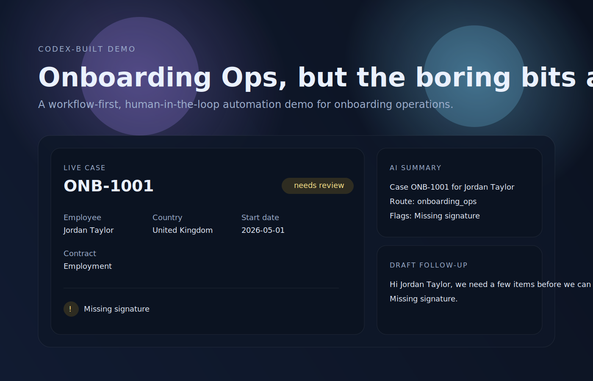

# Onboarding Operations Specialist Demo

[](LICENSE)
[](https://vitejs.dev/)
[](https://chatgpt.com/codex/cloud)

Built entirely by [Codex](https://chatgpt.com/codex/cloud) from OpenAI.

This repository is a deliberately cheeky demo of how an onboarding operations role can be turned into a workflow-driven, human-in-the-loop automation system.

It was inspired by a public job spec, rewritten into an anonymized blueprint, and framed as a small open-source prototype rather than a production HR platform.



## What it does

- Ingests onboarding requests from tickets, forms, or internal messages
- Extracts and normalizes employee and contract data
- Checks for missing fields, inconsistencies, and workflow blockers
- Drafts follow-up messages for humans to review and send
- Routes exceptions to the right internal queue
- Produces an audit trail for compliance and reporting
- Surfaces policy and process knowledge for operators

## Included In This Repo

- `docs/automation-blueprint.md` for the implementation view
- `docs/prototype-notes.md` for the scaffold overview
- `docs/demo-preview.svg` for a GitHub-friendly visual preview
- `spec/job-spec-anonymized.md` for the redacted source-inspired role spec
- `src/` for a tiny workflow prototype showing case intake, validation, routing, and drafting
- `index.html` and `src/web/` for a visual demo you can run in the browser

## What this is not

- Not legal advice
- Not a production HR platform
- Not a replacement for compliance review
- Not a claim that AI should make final employment decisions

## Demo scope

The goal is to show the shape of the automation:

1. Case intake
2. Document and data validation
3. AI-assisted triage and summarization
4. Exception routing
5. Status tracking and audit logging

## Suggested architecture

- Frontend: lightweight admin dashboard
- Workflow engine: case routing and state transitions
- AI layer: document extraction, summarization, and response drafting
- Rules layer: deterministic compliance checks
- Storage: case records, logs, templates, and knowledge base content

## Blueprint

See [docs/automation-blueprint.md](docs/automation-blueprint.md) for the implementation-focused breakdown of the workflow, guardrails, and demo scope.

## Prototype

See [docs/prototype-notes.md](docs/prototype-notes.md) for the layout of the small `src/` scaffold.

## Visual Demo

Run `npm install` and then `npm run dev` to open the browser demo.

## CLI Demo

Run `npm run demo:data` to print the sample case summary, routing decision, and drafted follow-up in the terminal.

## Quickstart

```bash
npm install
npm run dev
```

Optional terminal demo:

```bash
npm run demo:data
```

## Why this exists

The job spec describes work that is heavy on coordination, repeatable checks, documentation, and cross-team handoffs. That makes it a strong candidate for automation with a human review layer.

The point of the demo is simple: this kind of role is mostly a set of repeatable systems, and repeatable systems are exactly what automation is for.

## GitHub Notes

This repo is intentionally structured to look good on GitHub with:

- a concise landing page
- a visual preview asset
- an obvious `npm` workflow
- a readable blueprint and prototype split
- a minimal but real code path from intake to output

## Roadmap

- Add a richer multi-case dashboard
- Add sample event logs and audit trail views
- Add simple form input for case creation
- Add exportable JSON for demo data

## Changelog

- Added the automation blueprint
- Added the TypeScript workflow scaffold
- Added the browser demo
- Added the CLI demo
- Added GitHub-friendly preview assets and README polish

## License

MIT
