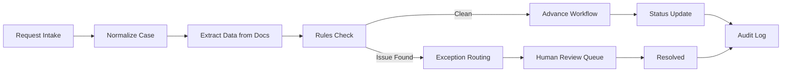

# Automation Blueprint

## Purpose

This demo shows how onboarding operations can be turned from a manual coordination-heavy role into a human-in-the-loop automation system.

The target is not to automate judgment out of the process. The target is to remove repetitive administration, surface risks early, and give operators a clean control plane.

## Problem Statement

Onboarding operations typically involve:

- Intake from multiple sources
- Checking documents and data for completeness
- Identifying routing or compliance issues
- Chasing missing information
- Coordinating between internal teams
- Updating records and audit logs
- Repeating the same communication patterns

That creates a workflow that is expensive in time, fragile in handoffs, and highly suitable for automation.

## Design Principles

- Keep humans in the loop for exceptions and approvals
- Use rules for deterministic checks
- Use AI for extraction, summarization, and drafting
- Make every action auditable
- Prefer workflow transparency over hidden automation
- Default to safe escalation when information is missing

## System Overview

## Workflow Stages

### 1. Intake

The system accepts onboarding requests from a ticketing queue, a form, or an internal handoff message.

Output:

- A case record
- A unique onboarding ID
- Initial metadata
- Source and timestamp

### 2. Normalization

Incoming data is standardized into a predictable schema.

Example fields:

- Employee name
- Start date
- Country
- Contract type
- Team or department
- Entity or hiring location
- Payroll path

### 3. Document Extraction

AI tools extract structured data from employment documents and supporting files.

Typical outputs:

- Contract dates
- Signatures present or missing
- Job title
- Compensation values
- Entity references
- Location references

### 4. Rules Validation

Deterministic checks catch issues early.

Examples:

- Missing mandatory fields
- Contradictory location data
- Unsigned documents
- Unsupported contract patterns
- Required approvals not present

### 5. Triage and Routing

If a case is clean, it continues automatically. If not, the system routes it to the correct team.

Possible queues:

- Payroll
- Mobility
- Benefits
- Legal or compliance
- Onboarding ops review

### 6. Communication Drafting

The system drafts standard messages for humans to approve or send.

Examples:

- Missing document request
- Clarification request
- Status update
- Exception escalation summary

### 7. Audit and Reporting

Every action is logged.

Audit trail items:

- Who changed what
- When it changed
- What triggered the change
- What was sent externally
- What was escalated and why

## Human-in-the-Loop Rules

The system should never silently finalize cases that involve:

- Compliance ambiguity
- Missing legal documents
- Unclear worker classification
- Conflicting jurisdiction data
- Approval-dependent exceptions

In those cases, the automation should:

- Flag the issue
- Summarize the concern
- Recommend the next action
- Pause progression until a human approves

## Demo Value

This blueprint demonstrates that the job can be decomposed into:

- A workflow engine
- A rules engine
- An AI assistance layer
- A review queue
- A logging and reporting layer

That is enough to make the point clearly: the role is not one job, it is several repeatable systems wearing one title.

## Suggested MVP

Build the smallest useful version first:

- Create case intake
- Validate required fields
- Summarize each case
- Draft follow-up messages
- Route exceptions
- Log every decision

That MVP is enough to show meaningful automation value without pretending to replace compliance or operations judgment.
